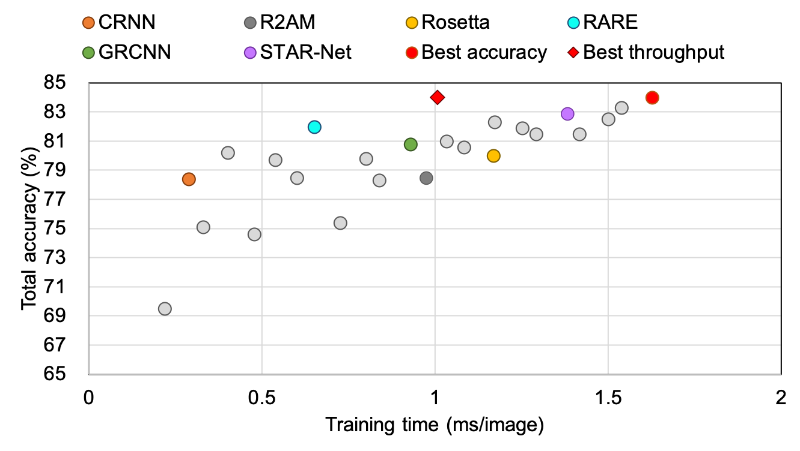
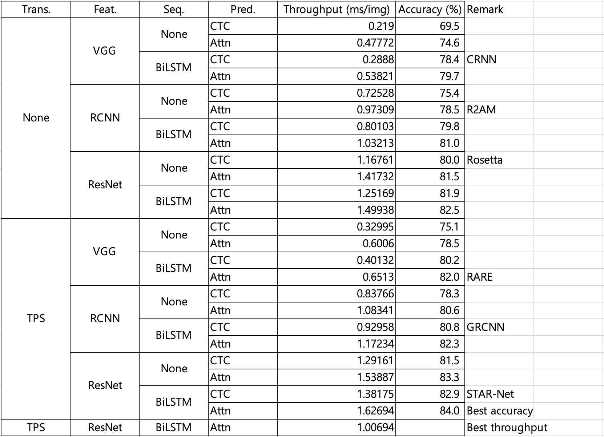

# Training throughput optimization for four-stage STR framework
| [paper](https://arxiv.org/abs/1904.01906) |

This project is a private project for the Naver Clova intern deep learning test. <br>
To optimize throughput, the following method was applied in this project based on the existing four-stage STR. <br>

  i) Maximizing batch size in GPU <br>
 ii) Fusing convolution and batch normalization layer <br>
iii) Partially half-precision training <br><br>



## Getting Started
### Dependency
- This work was tested with PyTorch 1.5.0a0, CUDA 10.2, python 3.6 and Ubuntu 18.04.
- This work was evaluated with Amazon p3.2xlarge instance (8 vCPU, 61GiB, NVIDIA Tesla V100 with 16GB HBM)
- requirements : lmdb, pillow, torchvision, nltk, natsort
```
pip3 install lmdb pillow torchvision nltk natsort
```


#### Training throughput results



## License
Copyright (c) 2019-present NAVER Corp.

Licensed under the Apache License, Version 2.0 (the "License");
you may not use this file except in compliance with the License.
You may obtain a copy of the License at

    http://www.apache.org/licenses/LICENSE-2.0

Unless required by applicable law or agreed to in writing, software
distributed under the License is distributed on an "AS IS" BASIS,
WITHOUT WARRANTIES OR CONDITIONS OF ANY KIND, either express or implied.
See the License for the specific language governing permissions and
limitations under the License.

